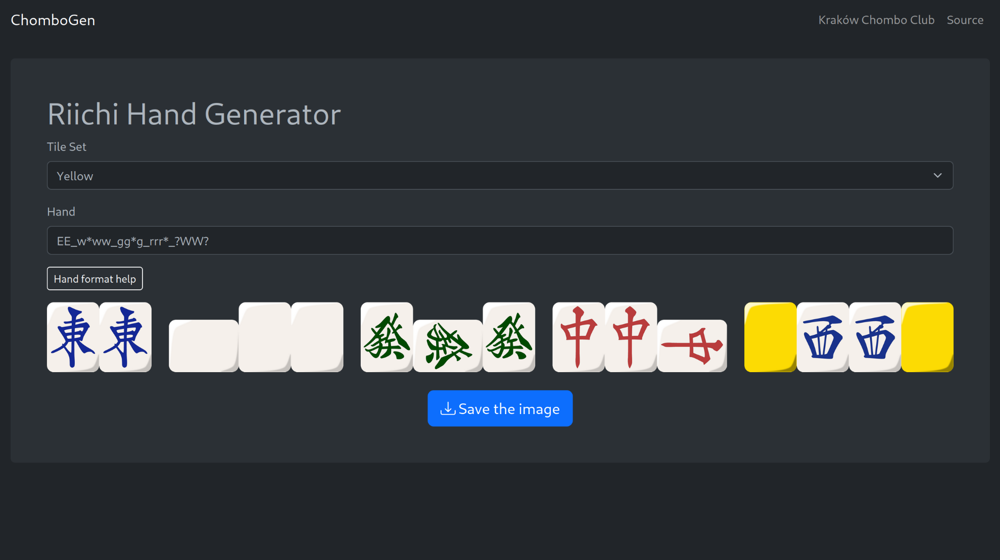

chombo-gen
==========

[](https://github.com/m4tx/chombo-gen/actions)
[](https://github.com/m4tx/chombo-gen/actions)
[](https://github.com/m4tx/chombo-gen/blob/master/LICENSE)

ChomboGen is a web service that allows to generate images of Japanese (Riichi) Mahjong hands. The hands are provided in a text format and are generated in PNG format.

**See it in action on [hand.chombo.club](https://hand.chombo.club).**



## Development

The project is written purely in [Rust](https://www.rust-lang.org/), both its backend and frontend.

### Backend

To run the development server, run:

```shell
cargo run
```

This will start the server at [localhost:8000](http://localhost:8000).

To build a release version, execute:

```shell
cargo build --release
```

The target binary will be put at `target/debug/chombo-gen-backend`.

### Frontend

Frontend uses the [yew](https://yew.rs/docs/getting-started/build-a-sample-app) framework. The code is compiled into a WebAssembly binary and then statically served.

First, install the [Trunk](https://trunkrs.dev/) bundler and add wasm32 target support to your Rust toolchain.

```shell
rustup target add wasm32-unknown-unknown
cargo install trunk
```

Then, you can use:

```shell
trunk serve
```

to start local server at [localhost:8080](http://localhost:8080). It assumes that the backend is running at [localhost:8000](http://localhost:8000).

To build a distributable version of the frontend, execute:

```shell
trunk build --release
```

This will build a website in `frontend/dist/` directory that can be statically served by a server such as nginx. You can override th backend URL by providing it as the `CHOMBO_GEN_API_URL` environment variable, like so:

```sh
export CHOMBO_GEN_API_URL=http://api.hand.example.com
trunk build --release
```

#### `pre-commit`
We encourage contributors to use predefined [`pre-commit`](https://pre-commit.com/) hooks — to install them in your local repo, make sure you have `pre-commit` installed and run:

```shell
pre-commit install
```

## Deployment

The easiest way to try locally or deploy _chombo-gen_ is to use auto-generated Docker images. There is a separate image for backend, frontend, and a reverse proxy (that exposes both the backend and frontend under the same server), all of which are published on [the GitHub Container Registry](https://github.com/m4tx?tab=packages&repo_name=chombo-gen). There is an example `docker-compose.yml` file provided in the repository root.

In the project root directory, execute:

```shell
docker compose up -d
```

After that, the website will be available on at [localhost:8000](http://localhost:8000).

## Attribution

This project uses [riichi-hand-rs](https://github.com/m4tx/riichi-hand-rs) library, which uses modified [riichi-mahjong-tiles](https://github.com/FluffyStuff/riichi-mahjong-tiles) by [FluffyStuff](https://github.com/FluffyStuff), licensed under [CC BY 4.0](https://creativecommons.org/licenses/by/4.0/).
